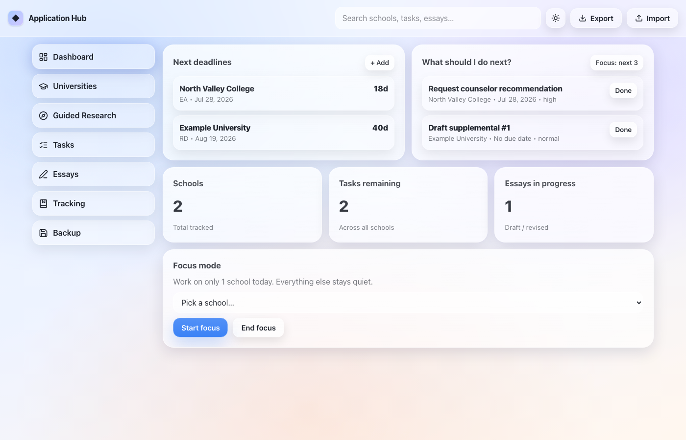
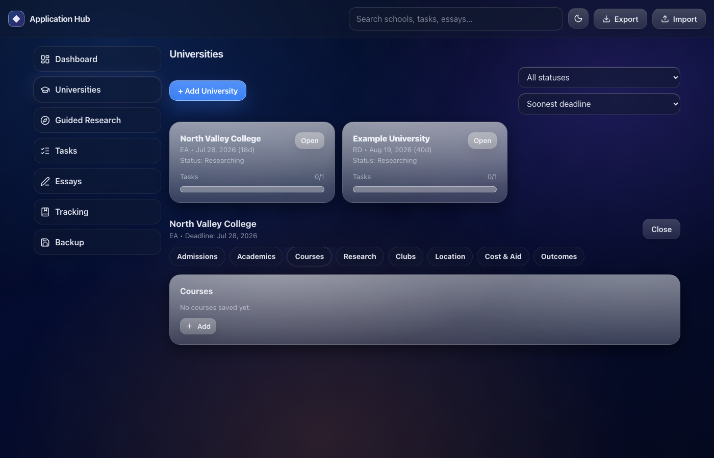

# University Application Hub

A React + TypeScript dashboard for tracking college applications: deadlines, tasks, essays, research notes, and decision status per school. Built for managing the entire application lifecycle from research through acceptance, with zero server overhead or login friction.

**Why this exists:** The college application process spans 6-12 months across 5-20 schools, each with its own deadlines, essay requirements, financial aid timelines, and decision pipelines. Spreadsheets get unwieldy fast. This app keeps everything in one place, sorted by urgency, with guided research checklists and essay drafting built in.

## Quick start

```bash
git clone <this-repo-url>
cd uni-app-tracker-2-0
npm install
npm run dev
```

Open the URL Vite prints (`http://localhost:5173`). Click **Skip (use demo data)** on first load if you just want to look around, or add a real school to start using it.

## Requirements

- Node 20+
- npm 10+ (ships with Node 20+)
- No API keys, no accounts, no backend to stand up. It's a static site.

## What it does

- **Dashboard**: next deadlines and next tasks sorted by urgency, a pipeline-breakdown chart, and a "focus mode" that hides every school except the one you pick.
- **Universities**: per-school profile with tabs for admissions notes, academics, courses, research/labs, clubs, location, cost & aid, outcomes.
- **Guided Research**: checklists for what to actually look up on a school's site (major requirements, two courses, a club, a professor, the net price calculator), plus 10/30/60-minute versions for when you've only got a few minutes.
- **Tasks**: a global queue across all schools, plus per-school views, with due dates and priority.
- **Essays**: unlimited supplementals per school, a rich-text editor with word/char counts and a word-limit warning, manual snapshots, and a story-vault / reusable-blocks section.
- **Tracking**: a status pipeline (Researching → Submitted → Accepted/Waitlisted/Rejected/...) and a submission checklist per school.
- **Backup**: export the whole thing to JSON, import it back later. Data lives in `localStorage` only.
- **⌘K / Ctrl K command menu**: jump to any page or school, toggle theme, export, without touching the mouse. `?` shows the full shortcut list.




## Stack

- React 19 + TypeScript, built with Vite
- Zustand for state, with its `persist` middleware handling `localStorage`
- React Router (`HashRouter`, so it deploys to any static host with zero config)
- Tailwind CSS v4 + CSS custom properties for the light/dark glass theme
- Motion (Framer Motion's successor) for transitions and the save-button state morph
- cmdk for the command menu, Recharts for the one actual chart, Lucide for icons, date-fns for date math
- oxlint for linting (Rust-based, near-instant)

Everything is client-side. No backend, no database.

## Scripts

```bash
npm run dev               # dev server with HMR
npm run build             # tsc type-check + production build → dist/
npm run preview           # serve the production build locally
npm run lint              # oxlint
npm run test:e2e          # run Playwright smoke + flow suites
npm run test:e2e:headed   # run Playwright in headed mode for debugging
```

Real output from `npm run build` on this machine:

```
$ npm run build

> uni-app-tracker-2-0@0.0.0 build
> tsc -b && vite build

vite v8.1.4 building client environment for production...
✓ 3160 modules transformed.
dist/index.html                   0.71 kB │ gzip:   0.41 kB
dist/assets/index-CVAaHzS-.css   43.53 kB │ gzip:   7.90 kB
dist/assets/index-D-E0BRRS.js   856.58 kB │ gzip: 258.42 kB
✓ built in 269ms

(!) Some chunks are larger than 500 kB after minification.
```

That warning is real and I haven't fixed it yet (see below).

## Project structure

```
src/
  types/          TypeScript types for the whole data model
  store/          Zustand stores (app data, toasts, search, UI/command-menu state)
  lib/            pure helpers (dates, ids, factories, backup/export)
  hooks/          autosave fields, debouncing, theme sync, global shortcuts
  components/
    ui/           Button, Modal, GlassCard, CommandPalette, Skeleton, ...
    layout/       top bar, side nav, app shell, background
    universities/ university card, profile panel, entry list editor
    tasks/        task modal, task list item
    essays/       rich-text editor, essay modal, note list editor
    dashboard/    pipeline breakdown chart
  screens/        loading (skeleton) + onboarding
  pages/          one file per route
legacy-vanilla/   the original plain HTML/CSS/JS version, kept for comparison
```

## Known quirks & limitations

- **No live demo deployed yet.** Run it locally for now.
- **Automated browser tests are now in place.** Playwright covers smoke, core flows, essays, the command palette, and unhappy-path validation.
- **Route-level code splitting is now wired in.** Heavy page modules and the command palette are loaded lazily so the first paint stays lighter.
- **Import isn't strictly validated.** Importing a JSON backup checks that it's an object and merges it into the default shape; it doesn't verify every field's type. A hand-edited or corrupted file could produce odd (not crashy) results.
- **The app now has a root error boundary.** A render error in a screen degrades to a recoverable fallback rather than crashing the whole app.
- **CI runs Playwright on push and pull requests.** The workflow installs dependencies, browsers, and executes the browser suite automatically.
- **Rich-text editor is intentionally basic** (bold/italic/underline/lists/headings via `execCommand`, no images or tables). A real editor library (TipTap, Lexical) is the upgrade path if that's ever needed.
- **Single-device only.** Data lives in one browser's `localStorage`. Export/import is the only way to move it, or to back it up before clearing browser data.
- Tested in Chrome on desktop during development. Not yet checked on a real mobile device or with a screen reader (the ARIA attributes are there, but "wrote the attribute" and "verified it works" are different claims and I'm only making the first one right now).

## What building this taught me

- How much a type system catches before you run the code. TypeScript flagged real bugs while I was migrating the data model from the old vanilla-JS version, every time correctly.
- Why people reach for a state library instead of passing props through six components: Zustand's whole API is "here's the state, here's how you change it," and once that clicked, prop-drilling stopped making sense to me.
- Chart type is a decision, not a default. My first instinct for "task completion" was a donut chart. A single ratio against a limit is what a plain progress meter is for. I only reached for an actual chart once I had a real comparison across categories (schools per pipeline stage).
- The hard part of a command menu (⌘K) isn't the animation, it's structuring pages, actions, and live data into one filterable list that still makes sense when you type three random letters.

## What's Next

### Planned features (in priority order)

- **Live demo**: deploy to CDN so you can try it without cloning
- **Multi-device sync**: keep your data in sync across phone, laptop, and tablet via optional cloud backup (no mandatory account)
- **Spreadsheet export**: download your schools/tasks/timeline as CSV for spreadsheet apps or sharing with parents/counselors
- **Calendar integration**: iCal feed so all deadlines appear in your calendar app without manual entry
- **PDF essay archival**: snapshot essays at submission time so you can see exactly what you sent, regardless of later edits
- **Progress analytics**: completion rates per school, essay drafting velocity, task burndown, to see progress at a glance
- **Shared view mode**: generate a read-only link to share your application tracker with a parent, counselor, or peer reviewer without giving edit access
- **Mobile app**: React Native version for a native iOS/Android experience (same codebase, native navigation)

## Deployment

This is a static React app: no backend, no database, no server runtime. Deploy to any CDN that serves static files.

### Option 1: AWS (recommended for production)

1. **Build locally**
   ```bash
   npm run build  # outputs to dist/
   ```

2. **Upload to S3**
   - Create an S3 bucket for static hosting (e.g., `uni-app-tracker-prod`)
   - Enable static website hosting on the bucket
   - Upload the `dist/` folder contents to the bucket root

   ```bash
   aws s3 sync dist/ s3://uni-app-tracker-prod/ --delete
   ```

3. **Serve via CloudFront** (for caching, HTTPS, and global edge locations)
   - Create a CloudFront distribution pointing to the S3 bucket
   - Set cache policy: 1 year for `index.html` (revalidate on deploy), 1 year for assets (hash in filename handles cache busting)
   - Attach an ACM certificate for your domain

4. **CI/CD pipeline** (GitHub Actions > S3 + CloudFront invalidation)
   - On push to `main`, GitHub Actions runs `npm run build && npm run test:e2e`
   - If tests pass, sync to S3 and invalidate CloudFront cache
   - Deploy is live in under 2 minutes

### Option 2: Vercel or Netlify (simpler, same result)

1. Connect your GitHub repo
2. Set build command: `npm run build`
3. Set publish directory: `dist`
4. Each push to `main` auto-deploys

Either way, your app is served from edge locations globally with HTTPS and zero cold starts.

## License

MIT (see [LICENSE](./LICENSE)).
